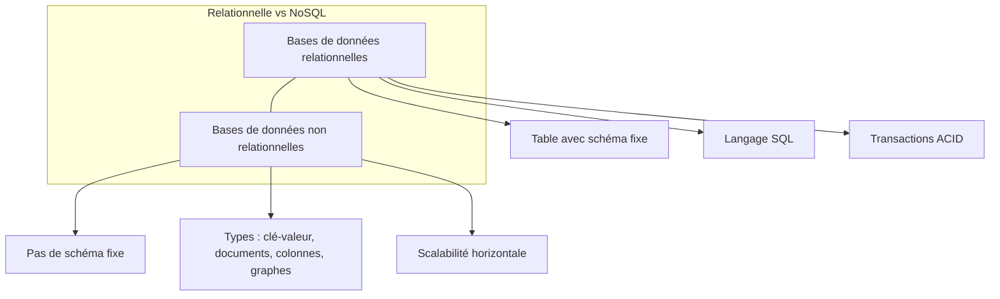

# 1-Persistance des données et bases de données en Go

## 1-Introduction à la persistance des données

### 1-Présentation des bases de données relationnelles et non relationnelles

La persistance des données est une étape incontournable dans le développement d’applications, permettant de conserver des informations même après l’arrêt du programme. En Go, un langage moderne et performant, l’utilisation efficace des bases de données est un enjeu majeur pour construire des applications robustes et scalables.

Cet article fait un focus précis sur les deux grandes familles de bases de données utilisées pour la persistance : les bases relationnelles et non relationnelles. Nous illustrerons ces concepts avec des exemples concrets en Go.

---

## Bases de données relationnelles

Une base de données relationnelle (RDBMS) organise les données sous forme de tables composées de lignes et colonnes, où chaque ligne représente un enregistrement unique et chaque colonne une propriété. Les relations entre ces tables sont définies via des clés primaires et étrangères, ce qui permet des jointures complexes entre données.

### Caractéristiques principales :

- **Structure rigide** : les tables respectent un schéma prédéfini (modèle relationnel).
- **SQL (Structured Query Language)** : langage standard pour requêter et manipuler les données.
- **Transactions ACID** : Garantie de l’intégrité via Atomicité, Cohérence, Isolation et Durabilité.
- **Exemples populaires** : PostgreSQL, MySQL, SQLite.

### Exemple simple en Go avec PostgreSQL

```go
package main

import (
    "database/sql"
    "fmt"
    _ "github.com/lib/pq"
)

func main() {
    connStr := "user=postgres password=secret dbname=mydb sslmode=disable"
    db, err := sql.Open("postgres", connStr)
    if err != nil {
        panic(err)
    }
    defer db.Close()

    var name string
    err = db.QueryRow("SELECT name FROM users WHERE id=$1", 1).Scan(&name)
    if err != nil {
        panic(err)
    }
    fmt.Println("User name:", name)
}
```

Ce code montre comment se connecter à une base relationnelle PostgreSQL, exécuter une requête et récupérer un champ.

---

## Bases de données non relationnelles

Les bases non relationnelles (NoSQL) s'affranchissent du modèle relationnel pour privilégier la flexibilité, la scalabilité horizontale et la rapidité sur de très grands volumes ou des données semi-structurées.

### Types principaux de bases NoSQL :

- **Clé-valeur** (ex : Redis, DynamoDB) : stockage simple associant une clé à une valeur.
- **Colonnes larges** (ex : Cassandra) : données organisées en colonnes dynamiques par ligne.
- **Documents** (ex : MongoDB) : stockage de documents JSON ou BSON, très flexible.
- **Graphes** (ex : Neo4j) : modélisation des données sous forme de graphes avec nœuds et relations.

### Propriétés :

- **Pas de schéma fixe** : adaptation aux données peu structurées.
- **Modèles de cohérence variables** : souvent eventual consistency au lieu d’un strict ACID.
- **Requêtage spécifique au type** (ex : requêtes MongoDB en JSON).

### Exemple simple en Go avec MongoDB

```go
package main

import (
    "context"
    "fmt"
    "go.mongodb.org/mongo-driver/mongo"
    "go.mongodb.org/mongo-driver/mongo/options"
)

func main() {
    client, err := mongo.Connect(context.TODO(), options.Client().ApplyURI("mongodb://localhost:27017"))
    if err != nil {
        panic(err)
    }
    defer client.Disconnect(context.TODO())

    collection := client.Database("mydb").Collection("users")
    filter := bson.D{{"id", 1}}

    var result struct{ Name string }
    err = collection.FindOne(context.TODO(), filter).Decode(&result)
    if err != nil {
        panic(err)
    }
    fmt.Println("User name:", result.Name)
}
```

Cet exemple montre comment interroger une collection MongoDB à partir de Go.

---

## Comparaison schématique (Mermaid)



---

## Conclusion

- Les bases relationnelles privilégient la cohérence, la structure et les requêtes complexes.
- Les bases non relationnelles privilégient la flexibilité, la scalabilité et la gestion des données semi-structurées.
- Go propose des bibliothèques officielles et communautaires pour interagir efficacement avec les deux types de bases.

Pour choisir la base adaptée, il faut analyser la nature des données, les besoins en cohérence, performance, et scalabilité.

---

## Sources

- [InterSystems - Bases relationnelles et non relationnelles](https://www.intersystems.com/fr/ressources/bases-de-donnees-relationnelles-et-non-relationnelles-differences-essentielles-pour-la-gestion-moderne-des-donnees/)
- [AWS - Differences relational and non-relational databases](https://aws.amazon.com/fr/compare/the-difference-between-relational-and-non-relational-databases/)
- [Top 10 bases de données en 2024 - Ambient IT](https://www.ambient-it.net/meilleures-base-de-donnees/)
- Expériences et documentations officielles des bibliothèques Go PostgreSQL et MongoDB

---

Cet article vous fournit une base claire et pratique sur les fondations des bases de données en Go, à des fins de persistance des données.