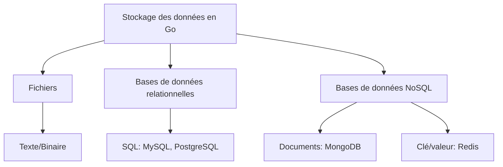

# 1-Persistance des données et bases de données en Go

## 1-Introduction à la persistance des données

### 2-Pourquoi et comment stocker les données en Go

---

## Pourquoi stocker les données ?

La persistance des données consiste à conserver les informations générées ou manipulées par une application au-delà de son exécution. Sans stockage persistant, les données disparaissent dès que le programme s’arrête, limitant sévèrement l’utilité pratique des applications.

- **Maintien de l’état applicatif** : Par exemple, pour une application e-commerce, conserver la liste des clients, produits, et commandes.
- **Partage et restitution** : Les données sauvegardées peuvent être consultées, modifiées et partagées entre différentes instances de l'application ou différents utilisateurs.
- **Audit et traçabilité** : Garder un historique des actions ou événements.
- **Analyse et prise de décision** : Stocker les données pour qu’elles soient exploitées pour des rapports, statistiques ou apprentissage machine.

---

## Comment stocker les données en Go ?

Le langage Go propose plusieurs approches pour stocker des données, adaptées au type, volume et fréquence d’accès exigés.

### 1. Fichiers (stockage simple)

Pour des besoins basiques, on peut stocker sous forme de fichiers texte ou binaire. Le package `os` et `io/ioutil` (ou `os` + `bufio`) permettent d’écrire et lire des fichiers.

```go
package main

import (
    "io/ioutil"
    "fmt"
)

func main() {
    data := []byte("Ceci est un texte à sauvegarder\n")
    err := ioutil.WriteFile("data.txt", data, 0644)
    if err != nil {
        panic(err)
    }
    readData, err := ioutil.ReadFile("data.txt")
    if err != nil {
        panic(err)
    }
    fmt.Println(string(readData))
}
```

### Limites : peu adapté pour gérer des données structurées, relationnelles ou volumineuses.

---

### 2. Bases de données relationnelles

En choisissant une base relationnelle (ex. MySQL, PostgreSQL), on stocke les données sous forme de tables normalisées. Go supporte SQL via son package standard `database/sql` et des pilotes tiers.

- Permet requêtes complexes (jointures, filtrage).
- Transactions fiables.
- Indexation pour optimiser les recherches.

### Exemple : insertion en base PostgreSQL

```go
package main

import (
    "database/sql"
    _ "github.com/lib/pq"
)

func main() {
    db, err := sql.Open("postgres", "user=postgres dbname=app sslmode=disable")
    if err != nil {
        panic(err)
    }
    defer db.Close()
    _, err = db.Exec("INSERT INTO users(name,email) VALUES($1,$2)", "Alice", "alice@example.com")
    if err != nil {
        panic(err)
    }
}
```

---

### 3. Bases de données NoSQL

Idéales pour données semi-structurées, massives ou avec modèles flexibles (ex : MongoDB, Redis).

- Stockage orienté documents, valeurs-clés, colonnes ou graphes.
- Sans schéma rigide, adapté aux évolutions rapides.
- Scalabilité horizontale facilitée.

### Exemple : insertion d’un document MongoDB en Go

```go
package main

import (
    "context"
    "go.mongodb.org/mongo-driver/bson"
    "go.mongodb.org/mongo-driver/mongo"
    "go.mongodb.org/mongo-driver/mongo/options"
    "log"
)

func main() {
    client, err := mongo.Connect(context.TODO(), options.Client().ApplyURI("mongodb://localhost:27017"))
    if err != nil {
        log.Fatal(err)
    }
    collection := client.Database("app").Collection("users")
    user := bson.D{{"name", "Bob"}, {"email", "bob@example.com"}}
    _, err = collection.InsertOne(context.TODO(), user)
    if err != nil {
        log.Fatal(err)
    }
}
```

---

## Diagramme Mermaid : Panorama des options pour stocker des données en Go



---

## Bonnes pratiques

- Choisir le mode de stockage en fonction de la nature des données et du besoin : structure rigide ou flexible, volumes, performances.
- Gérer correctement les erreurs de lecture/écriture pour garantir la fiabilité des données.
- Utiliser des connexions et gestionnaire de pool pour les bases relationnelles.
- Prévoir la sérialisation/desérialisation adaptée (JSON, BSON, GOB).
- Assurer la sécurité des données (chiffrement, authentification).
 
---

## Sources

- [Go by Example - Reading and Writing Files](https://gobyexample.com/reading-files)
- [Go database/sql documentation](https://pkg.go.dev/database/sql)
- [MongoDB Go Driver documentation](https://www.mongodb.com/docs/drivers/go/current/)
- [DigitalOcean - SQL vs NoSQL databases](https://www.digitalocean.com/community/tutorials/sql-vs-nosql-databases)
- [MongoDB vs PostgreSQL - StackShare](https://stackshare.io/stackups/mongodb-vs-postgresql)

---

Cet article fournit un panorama clair et concis des raisons et méthodes pour stocker les données en Go, donnant des exemples concrets pour chaque cas d’usage.