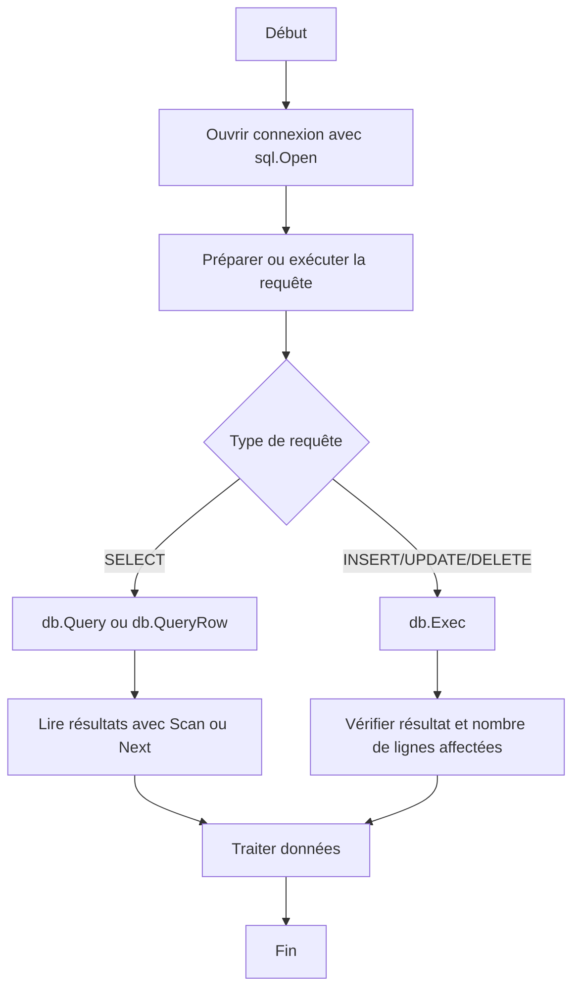

# 1-Persistance des données et bases de données en Go

## 2-Utilisation de la bibliothèque SQL standard

### 2-Exécuter des requêtes SQL (SELECT, INSERT, UPDATE, DELETE)

---

La bibliothèque standard `database/sql` en Go fournit une interface uniforme pour exécuter des requêtes SQL classiques telles que `SELECT`, `INSERT`, `UPDATE` et `DELETE`. Ce package fonctionne généralement avec un pilote spécifique (ex : `lib/pq` pour PostgreSQL) qui gère la communication directe avec la base.

Ce guide synthétise comment on exécute ces différentes requêtes en Go, avec des exemples exploitables.

---

## Préparation : connexion à la base

Pour exploiter les exemples, on considère une connexion PostgreSQL déjà établie comme suit :

```go
db, err := sql.Open("postgres", "user=postgres password=secret dbname=mydb sslmode=disable")
if err != nil {
    panic(err)
}
defer db.Close()
```

---

## 1. Exécuter une requête SELECT

Le but est de récupérer des données.

### Méthodes importantes :

- `db.Query(query, args...)` : pour récupérer plusieurs lignes.
- `db.QueryRow(query, args...)` : pour une seule ligne.

### Exemple : récupération d’un utilisateur par id

```go
type User struct {
    ID    int
    Name  string
    Email string
}

var user User
err := db.QueryRow("SELECT id, name, email FROM users WHERE id = $1", 1).Scan(&user.ID, &user.Name, &user.Email)
if err != nil {
    if err == sql.ErrNoRows {
        fmt.Println("Aucun utilisateur trouvé")
    } else {
        panic(err)
    }
}
fmt.Printf("Utilisateur: %+v\n", user)
```

### Lecture de plusieurs lignes

```go
rows, err := db.Query("SELECT id, name, email FROM users")
if err != nil {
    panic(err)
}
defer rows.Close()

for rows.Next() {
    var u User
    err := rows.Scan(&u.ID, &u.Name, &u.Email)
    if err != nil {
        panic(err)
    }
    fmt.Printf("User: %+v\n", u)
}

if err = rows.Err(); err != nil {
    panic(err)
}
```

---

## 2. Exécuter une requête INSERT

Pour ajouter des données, on utilise la méthode `Exec`.

```go
res, err := db.Exec("INSERT INTO users(name, email) VALUES ($1, $2)", "Alice", "alice@example.com")
if err != nil {
    panic(err)
}

rowCount, err := res.RowsAffected()
if err != nil {
    panic(err)
}
fmt.Printf("Nombre de lignes insérées : %d\n", rowCount)
```

Pour récupérer l’ID inséré (si auto-incrémenté), il faut souvent utiliser une requête différente avec `RETURNING`.

```go
var lastInsertID int
err := db.QueryRow("INSERT INTO users(name, email) VALUES ($1, $2) RETURNING id", "Bob", "bob@example.com").Scan(&lastInsertID)
if err != nil {
    panic(err)
}
fmt.Println("Last inserted ID:", lastInsertID)
```

---

## 3. Exécuter une requête UPDATE

Met à jour les données existantes.

```go
res, err := db.Exec("UPDATE users SET email = $1 WHERE id = $2", "newemail@example.com", 1)
if err != nil {
    panic(err)
}

count, err := res.RowsAffected()
if err != nil {
    panic(err)
}
fmt.Printf("Nombre de lignes mises à jour : %d\n", count)
```

---

## 4. Exécuter une requête DELETE

Supprime des données.

```go
res, err := db.Exec("DELETE FROM users WHERE id = $1", 1)
if err != nil {
    panic(err)
}

count, err := res.RowsAffected()
if err != nil {
    panic(err)
}
fmt.Printf("Nombre de lignes supprimées : %d\n", count)
```

---

## Prévention des injections SQL

Toujours utiliser des arguments paramétrés (placeholders `$1`, `$2`, etc.) — comme dans les exemples ci-dessus — plutôt que de concaténer directement des chaînes dans la requête, ce qui est un risque d’injection SQL.

---

## Diagramme Mermaid : Cycle d’exécution d’une requête SQL en Go



---

## Sources et références

- Documentation Go `database/sql` : https://pkg.go.dev/database/sql
- Tutoriel PostgreSQL avec Go : https://www.calhoun.io/he-uses-postgresql-and-go-database-sql-part-1/
- Guide officiel PostgreSQL pour Go (lib/pq) : https://github.com/lib/pq
- Sécurité SQL en Go : https://go.dev/doc/database/

---

Cet article présente les bases pour exécuter efficacement les principales requêtes SQL avec la bibliothèque standard Go, donnant à la fois les bonnes pratiques et la sécurité nécessaire pour manipuler les bases relationnelles.