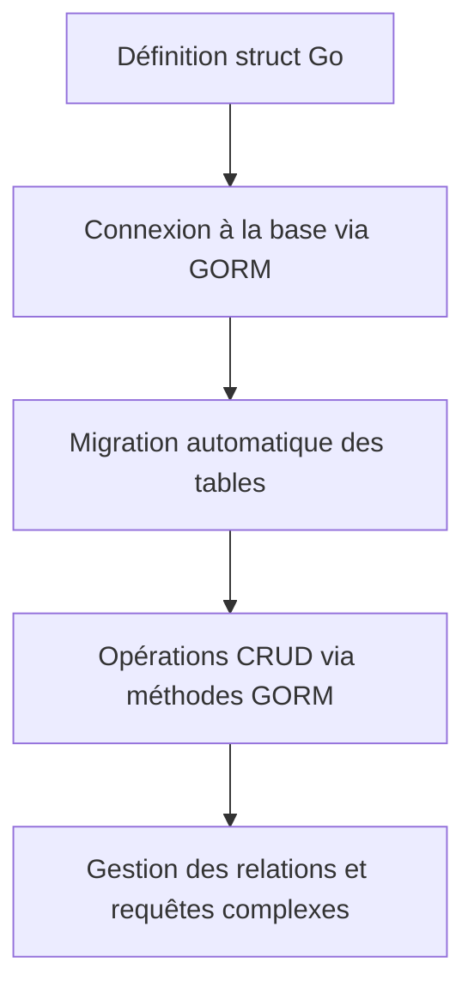

# 1-Persistance des données et bases de données en Go

## 3-Utilisation d'un ORM simple en Go

### 1-Présentation d'un ORM Go (ex : GORM)

---

## Qu'est-ce qu'un ORM ?

ORM signifie *Object-Relational Mapping* (ou Mapping objet-relationnel). C’est un outil ou bibliothèque qui facilite la manipulation des bases de données relationnelles en permettant au développeur d’interagir avec la base à travers des objets Go plutôt que des requêtes SQL manuelles.

En Go, utiliser un ORM aide à accélérer le développement, à améliorer la lisibilité du code et à réduire les erreurs liées au SQL.

---

## Présentation de GORM

[GORM](https://gorm.io) est l'ORM Go le plus populaire et complet. Il supporte plusieurs bases relationnelles, dont PostgreSQL, MySQL, SQLite, SQL Server.

### Caractéristiques principales de GORM:

- Mappage automatique des structs Go en tables SQL.
- Gestion des relations (`has one`, `has many`, `belongs to`, etc).
- Migrations automatiques des schémas.
- Requêtes CRUD simplifiées.
- Hooks, transactions et requêtes complexes.
- Support de JSON, et types personnalisés.

---

## Installation

```bash
go get -u gorm.io/gorm
go get -u gorm.io/driver/postgres
```

---

## Exemple simple : Connexion à PostgreSQL et manipulation d’une table `users`

```go
package main

import (
    "fmt"
    "gorm.io/driver/postgres"
    "gorm.io/gorm"
    "time"
)

// Définition du modèle
type User struct {
    ID        uint           `gorm:"primaryKey"`
    Name      string
    Email     string         `gorm:"uniqueIndex"`
    CreatedAt time.Time
    UpdatedAt time.Time
}

func main() {
    dsn := "host=localhost user=postgres password=secret dbname=mydb port=5432 sslmode=disable"
    db, err := gorm.Open(postgres.Open(dsn), &gorm.Config{})
    if err != nil {
        panic("échec de la connexion")
    }
    
    // Migration automatique : crée la table si elle n’existe pas
    err = db.AutoMigrate(&User{})
    if err != nil {
        panic(err)
    }

    // Création d'un utilisateur
    user := User{Name: "Alice", Email: "alice@example.com"}
    result := db.Create(&user)
    if result.Error != nil {
        panic(result.Error)
    }
    fmt.Printf("Utilisateur créé avec l’ID: %d\n", user.ID)

    // Lecture
    var u User
    db.First(&u, "email = ?", "alice@example.com")
    fmt.Printf("Utilisateur trouvé : %#v\n", u)
}
```

---

## Points forts de GORM

- **Abstraction des requêtes** : Plus besoin d’écrire du SQL, les fonctions Go suffisent.
- **Migration intégrée** : Le schéma évolue automatiquement avec les modèles Go.
- **Prise en charge avancée des relations** et préchargement (`Preload`) pour optimiser les requêtes.
- **Communauté active** et documentation complète.

---

## Diagramme Mermaid : Flux d’utilisation de GORM



---

## Comparaison rapide ORM vs `database/sql`

| Aspect            | `database/sql`                     | GORM                              |
|-------------------|----------------------------------|----------------------------------|
| Complexité        | Bas niveau, requêtes écrites     | Haut niveau, abstraction SQL      |
| Productivité      | Moins rapide pour CRUD basiques  | Plus rapide avec modèles Go       |
| Flexibilité       | Complète, toute requête possible | Parfois moins adaptée aux requêtes complexes très spécifiques |
| Courbe d’apprentissage | Faible → requêtes SQL         | Moyenne → apprentissage des conventions GORM |

---

## Sources

- Site officiel GORM : https://gorm.io
- Documentation GORM : https://gorm.io/docs/
- Guide pratique Go avec GORM sur DigitalOcean : https://www.digitalocean.com/community/tutorials/how-to-use-gorm-to-access-a-database-with-golang
- Article Medium "Using GORM ORM on Go" : https://medium.com/swlh/using-gorm-orm-on-go-4bbc58b655e8

---

GORM facilite la manipulation des bases relationnelles en Go avec une ergonomie orientée objet tout en offrant une grande puissance fonctionnelle, ce qui en fait un choix pertinent pour de nombreux projets.