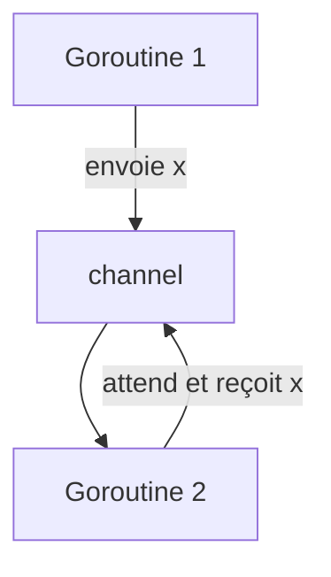

# 2-Concurrence et Web temps réel

## 1-Introduction à la concurrence en Go

### 1-Principe des goroutines et channels

---

Go est conçu avec la concurrence en son cœur. Deux concepts fondamentaux permettent la gestion efficace des tâches parallèles : **les goroutines** et **les channels**.

---

## Les goroutines : exécution concurrente légère

Une goroutine est une fonction ou méthode qui s’exécute de manière concurrente avec les autres goroutines dans le même espace mémoire.

### Démarrer une goroutine

Pour lancer une goroutine, il suffit de préfixer l’appel de fonction par le mot-clé `go` :

```go
go fonction()
```

Elle s’exécute ensuite en arrière-plan, permettant au programme principal de continuer.

### Exemple simple

```go
package main
import (
    "fmt"
    "time"
)

func sayHello() {
    for i := 0; i < 5; i++ {
        fmt.Println("Hello", i)
        time.Sleep(100 * time.Millisecond)
    }
}

func main() {
    go sayHello()
    time.Sleep(600 * time.Millisecond) // attendre que la goroutine finisse
    fmt.Println("Main termine")
}
```

Sans le `time.Sleep` dans `main`, le programme pourrait se terminer avant que `sayHello` ait fini.

---

## Les channels : communication et synchronisation entre goroutines

Les goroutines partagent la mémoire, mais la synchronisation directe peut entraîner des conditions de course. Go recommande la communication par échange de messages via les **channels**.

### Définition

Un channel est une structure permettant d’envoyer et recevoir des valeurs entre goroutines de façon sécurisée.

```go
ch := make(chan int) // canal d’entiers
```

### Opérations principales

- `ch <- value` : envoi dans le channel (bloquant si le channel est plein ou non lu).
- `value := <- ch` : réception depuis le channel (bloquant si vide).

### Exemple simple : échange via channel

```go
package main
import "fmt"

func square(n int, ch chan int) {
    ch <- n * n // envoie le carré de n dans ch
}

func main() {
    ch := make(chan int)

    go square(5, ch)
    result := <-ch
    fmt.Println("Carré reçu :", result)
}
```

---

## Buffered vs Unbuffered Channels

- **Unbuffered** (sans capacité) : envoi et réception sont synchrones, les deux goroutines attendent.
- **Buffered** (avec capacité) :

```go
ch := make(chan int, 3)
```

Les envois sont non bloquants tant que le buffer n’est pas plein.

---

## Patterns fréquents

### Fan-out, fan-in

Plusieurs workers (goroutines) consomment d’une source commune, et leurs résultats sont agrégés via un channel.

### Select

Permet de gérer simultanément plusieurs opérations sur plusieurs channels, pour la multiplexion des communications.

---

## Diagramme Mermaid : communication entre goroutines via channel



---

## Points importants

- Lancer trop de goroutines peut engendrer des surcharges : Go est efficace mais pas illimité.
- Les channels assurent la synchronisation et la sécurité des données.
- Eviter les partages de mémoire explicite grâce aux channels.
- `sync` package offre des primitives complémentaires (mutex, waitgroup).

---

## Sources et références

- [Effective Go - Concurrency](https://go.dev/doc/effective_go#concurrency)
- [Go by Example - Goroutines](https://gobyexample.com/goroutines)
- [Go by Example - Channels](https://gobyexample.com/channels)
- [Official Go Blog - Concurrency is not parallelism](https://blog.golang.org/concurrency-is-not-parallelism)
- [Go blog: Package sync](https://pkg.go.dev/sync)

---

La combinaison des goroutines et des channels forme la base de la programmation concurrente en Go, puissantes pour écrire des programmes scalables, simples et efficaces.