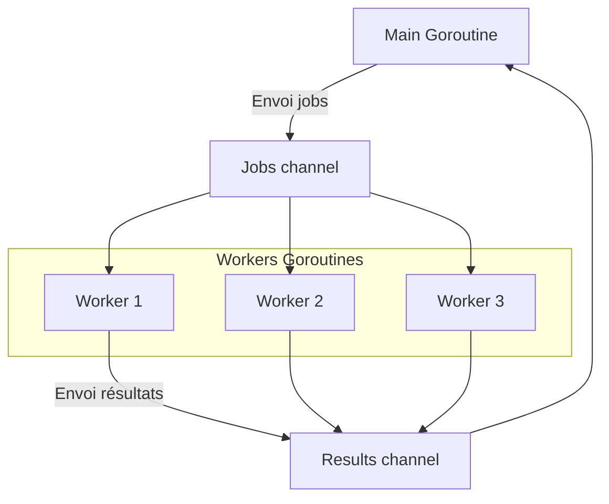

# 2-Concurrence et Web temps réel

## 2-Gestion des opérations simultanées

### 2-Communication sécurisée entre goroutines avec channels

---

Les **goroutines** ont révolutionné la programmation concurrente en Go en offrant une abstraction légère pour exécuter des fonctions simultanément. Cependant, la véritable force de Go réside dans la façon dont ces goroutines communiquent et se synchronisent. Les **channels** sont la solution native pour ce besoin, garantissant une communication sécurisée et sans conditions de courses.

---

## 1. Qu’est-ce qu’un channel ?

Un **channel** est un conduit typé pour envoyer et recevoir des valeurs entre goroutines. Il assure la synchronisation entre l'expéditeur et le récepteur, évitant le piège des accès concurrents à une même donnée.

On crée un channel avec `make` :

```go
ch := make(chan int)
```

Ce channel transmet des entiers.

---

## 2. Communication de base avec channels

### Envoi

```go
ch <- 42
```

Envoie la valeur 42 dans le channel. Cette opération bloque si personne ne lit le channel (channel non bufferisé).

### Réception

```go
val := <-ch
```

Lit et retire une valeur du channel. Cette opération bloque si aucun message n’est disponible.

---

### Exemple simple : producteur-consommateur

```go
package main

import "fmt"

func producer(ch chan<- int) {
    for i := 1; i <= 5; i++ {
        ch <- i
    }
    close(ch) // signaler qu'il n'y aura plus d'envoi
}

func consumer(ch <-chan int) {
    for v := range ch {
        fmt.Println("Reçu:", v)
    }
}

func main() {
    ch := make(chan int)
    go producer(ch)
    consumer(ch)
}
```

---

## 3. Buffered (tamponné) vs unbuffered (non tamponné) channels

- **Unbuffered** : envoi et réception bloquants, idéale pour synchroniser étroitement les goroutines.
- **Buffered** : permet d’envoyer jusqu’à N éléments sans blocage, utile pour découpler producteur et consommateur.

```go
ch := make(chan int, 3)  // buffer de taille 3
```

---

## 4. Utiliser `select` pour la multiplexion

Le mot-clé `select` permet d’attendre sur plusieurs opérations simultanément, facilitant la gestion des communications sur plusieurs channels.

```go
select {
case msg1 := <-chan1:
    fmt.Println("Message reçu sur chan1 :", msg1)
case chan2 <- 42:
    fmt.Println("Valeur 42 envoyée sur chan2")
default:
    fmt.Println("Aucune communication disponible")
}
```

---

## 5. Fermeture des channels

Utiliser `close(ch)` pour indiquer qu’aucune nouvelle valeur ne sera envoyée. La réception continue jusqu’à ce que le channel soit vide.

La fonction `range` sur un channel s’interrompt automatiquement à la fermeture.

```go
for v := range ch {
    fmt.Println(v)
}
```

---

## 6. Exemple complet avec synchronisation

```go
package main

import (
    "fmt"
    "sync"
)

func worker(id int, jobs <-chan int, results chan<- int, wg *sync.WaitGroup) {
    defer wg.Done()
    for j := range jobs {
        fmt.Printf("Worker %d traitement du job %d\n", id, j)
        results <- j * 2
    }
}

func main() {
    jobs := make(chan int, 5)
    results := make(chan int, 5)
    var wg sync.WaitGroup

    for w := 1; w <= 3; w++ {
        wg.Add(1)
        go worker(w, jobs, results, &wg)
    }

    for j := 1; j <= 5; j++ {
        jobs <- j
    }
    close(jobs)

    wg.Wait()
    close(results)

    for res := range results {
        fmt.Println("Résultat:", res)
    }
}
```

---

## Diagramme Mermaid : Communication et synchronisation via channels



---

## Points importants

- Les channels évitent explicitement les conditions de courses en s’appuyant sur la synchronisation bloquante.
- Les channels tampons (buffered) améliorent la performance en autorisant un découplage producteur/consommateur.
- `select` est essentiel pour gérer plusieurs sources d'événements concurrents.
- Toujours fermer un channel uniquement du côté expéditeur.
- Préférer la communication via channels à la synchronisation en partageant la mémoire.

---

## Sources

- [Golang official documentation – Channels](https://golang.org/doc/effective_go#channels)
- [Go by Example – Channels](https://gobyexample.com/channels)
- [Golang blog – Concurrency is not parallelism](https://blog.golang.org/concurrency-is-not-parallelism)
- [Go by Example – Select](https://gobyexample.com/select)
- [Go Wiki – Concurrency Patterns](https://github.com/golang/go/wiki/Concurrency)

---

Les channels sont au cœur du modèle concurrent de Go, offrant un moyen simple, efficace et sécurisé pour transmettre des données entre goroutines. Leur compréhension permet d’écrire des programmes concurrentiels robustes, sans risques habituels liés à la gestion manuelle des accès mémoire partagés.