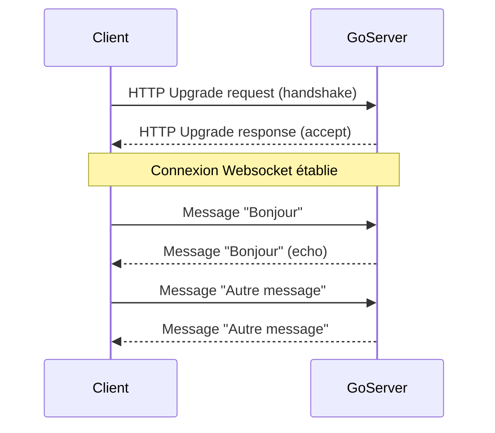

# 2-Concurrence et Web temps réel

## 3-Go pour le Web temps réel

### 1-Notions de Websocket et implémentation simple en Go

---

## Comprendre le Websocket

Le Websocket est un protocole de communication full-duplex (bidirectionnel) sur une seule connexion TCP. Contrairement au protocole HTTP classique, Websocket permet à un client et un serveur d’échanger des messages en temps réel, sans avoir à rouvrir la connexion à chaque message.

**Principaux avantages :**

- Communication bidirectionnelle permanente.
- Faible latence et surcharge réduite.
- Adapté pour les applications temps réel : chat, jeux, notifications, tableaux de bord…

---

## Fonctionnement

Le client initie une **handshake HTTP** vers le serveur avec une requête spéciale. Si accepté, la connexion est mise à niveau (upgrade) au protocole Websocket.

Une fois établie, la connexion reste ouverte et les messages sont échangés en tant que frames.

---

## Websocket en Go

### Bibliothèque populaire

Le package tiers `github.com/gorilla/websocket` est le plus utilisé pour implémenter un serveur Websocket en Go, car il simplifie le handshake et la gestion du protocole.

---

## Implémentation simple d’un serveur Websocket

```go
package main

import (
    "fmt"
    "log"
    "net/http"

    "github.com/gorilla/websocket"
)

// Configuration pour autoriser les upgrades Websocket
var upgrader = websocket.Upgrader{
    ReadBufferSize:  1024,
    WriteBufferSize: 1024,
    // Autoriser toutes les connexions (pas recommandé en prod)
    CheckOrigin: func(r *http.Request) bool { return true },
}

func wsHandler(w http.ResponseWriter, r *http.Request) {
    conn, err := upgrader.Upgrade(w, r, nil)
    if err != nil {
        log.Println("Erreur upgrade:", err)
        return
    }
    defer conn.Close()

    for {
        // Lire message du client
        messageType, message, err := conn.ReadMessage()
        if err != nil {
            log.Println("Erreur lecture:", err)
            break
        }
        fmt.Printf("Reçu: %s\n", message)

        // Echo le message reçu
        err = conn.WriteMessage(messageType, message)
        if err != nil {
            log.Println("Erreur écriture:", err)
            break
        }
    }
}

func main() {
    http.HandleFunc("/ws", wsHandler)
    log.Println("Serveur Websocket démarré sur :8080")
    log.Fatal(http.ListenAndServe(":8080", nil))
}
```

---

## Explications clés

- `websocket.Upgrader` effectue le handshake HTTP et upgrade la connexion.
- `conn.ReadMessage()` lit les messages entrants.
- `conn.WriteMessage()` renvoie les messages au client (ici effet echo).
- `CheckOrigin` doit être personnalisé pour sécuriser les origines autorisées.

---

## Exemple minimal côté client (JavaScript)

```javascript
const socket = new WebSocket("ws://localhost:8080/ws");

socket.onopen = () => {
    console.log("Connecté au serveur");
    socket.send("Bonjour serveur");
};

socket.onmessage = (event) => {
    console.log("Message reçu:", event.data);
};

socket.onerror = (error) => {
    console.error("Erreur Websocket:", error);
};
```

---

## Diagramme Mermaid : cycle d’un Websocket avec Go



---

## Bonnes pratiques

- Toujours valider l’origine (`CheckOrigin`) dans `upgrader` pour éviter les attaques CSRF.
- Gérer correctement la fermeture de la connexion (`Close`).
- Traiter les erreurs de lecture et écriture.
- Pour une vraie application, gérer plusieurs connexions simultanément, souvent avec un hub central utilisant des goroutines et channels.

---

## Sources et références

- [Gorilla Websocket GitHub](https://github.com/gorilla/websocket)
- [MDN Web Docs - WebSockets](https://developer.mozilla.org/fr/docs/Web/API/WebSockets_API)
- [Tutorial "Getting Started with WebSockets in Go" - Real Python](https://realpython.com/websockets-python/)
- [GoDoc - websocket package](https://pkg.go.dev/github.com/gorilla/websocket)
- [Blog Gopher Academy - Building WebSocket servers in Go](https://blog.gopheracademy.com/advent-2014/websockets/)

---

L'implémentation basique d'un serveur Websocket en Go, appuyée par la robustesse des goroutines, ouvre la porte à des architectures web réactives et interactives à faible latence. Ce modèle facilite les interactions bidirectionnelles indispensables aux applications modernes temps réel.