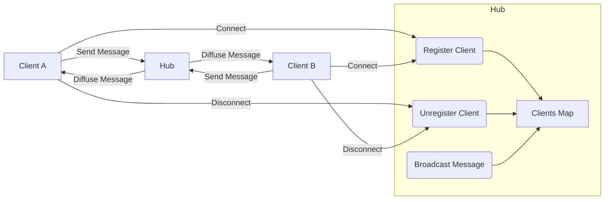

# 2-Concurrence et Web temps réel

## 3-Go pour le Web temps réel

### 2-Exemple d'application temps réel : chat ou notifications

---

Construire une application temps réel avec Go s’appuie souvent sur l’utilisation des **websockets** pour la communication bidirectionnelle entre client et serveur. Un cas concret fréquent est le chat en temps réel ou les notifications instantanées.

Cet article présente une implémentation simplifiée d’un serveur de chat en Go, mettant en œuvre goroutines, channels et Websocket pour gérer plusieurs clients simultanés.

---

## Architecture d’un chat temps réel en Go

Le serveur Websocket doit :

- Accepter de multiples connexions clients.
- Distribuer les messages de chaque client à tous les autres.
- Gérer la connexion et la déconnexion dynamique.
- Assurer la synchronisation concurrente sans conditions de course.

L’approche classique consiste à utiliser un **hub central** global qui orchestre les échanges via des channels.

---

## Exemple de serveur de chat simple

```go
package main

import (
    "log"
    "net/http"

    "github.com/gorilla/websocket"
)

// Connexion de client websocket
type client struct {
    conn *websocket.Conn
    send chan []byte
}

// Hub gérant toutes les connexions et messages
type hub struct {
    clients    map[*client]bool
    broadcast  chan []byte
    register   chan *client
    unregister chan *client
}

var h = hub{
    clients:    make(map[*client]bool),
    broadcast:  make(chan []byte),
    register:   make(chan *client),
    unregister: make(chan *client),
}

func (h *hub) run() {
    for {
        select {
        case c := <-h.register:
            h.clients[c] = true
        case c := <-h.unregister:
            if _, ok := h.clients[c]; ok {
                delete(h.clients, c)
                close(c.send)
            }
        case message := <-h.broadcast:
            for c := range h.clients {
                select {
                case c.send <- message:
                default:
                    close(c.send)
                    delete(h.clients, c)
                }
            }
        }
    }
}

var upgrader = websocket.Upgrader{
    CheckOrigin: func(r *http.Request) bool { return true }, // en production, restreindre
}

func serveWs(w http.ResponseWriter, r *http.Request) {
    conn, err := upgrader.Upgrade(w, r, nil)
    if err != nil {
        log.Println("Upgrade error:", err)
        return
    }
    c := &client{conn: conn, send: make(chan []byte, 256)}
    h.register <- c

    go c.writePump()
    c.readPump()
}

func (c *client) readPump() {
    defer func() {
        h.unregister <- c
        c.conn.Close()
    }()
    for {
        _, message, err := c.conn.ReadMessage()
        if err != nil {
            break
        }
        h.broadcast <- message
    }
}

func (c *client) writePump() {
    for msg := range c.send {
        err := c.conn.WriteMessage(websocket.TextMessage, msg)
        if err != nil {
            break
        }
    }
    c.conn.Close()
}

func main() {
    go h.run()
    http.HandleFunc("/ws", serveWs)
    log.Println("Serveur de chat démarré sur :8080")
    log.Fatal(http.ListenAndServe(":8080", nil))
}
```

---

## Explications clés

- **Struct `hub`** : centralise l’ensemble des clients et les messages à diffuser.
- Channels `register`, `unregister` permettent de gérer dynamiquement les connexions.
- Channel `broadcast` diffuse chaque message à tous les clients.
- Chaque client a une goroutine `writePump` pour envoyer les messages reçus via son channel.
- La méthode `readPump` lit les messages entrants et les transmet au hub.
- Le design évite les accès concurrents non contrôlés via la synchronisation par channels.

---

## Exemple minimal client HTML/JavaScript

```html
<!DOCTYPE html>
<html>
<head><title>Chat Websocket</title></head>
<body>
<input id="input" type="text" autocomplete="off"/>
<button onclick="send()">Envoyer</button>
<ul id="messages"></ul>

<script>
    const ws = new WebSocket("ws://localhost:8080/ws");

    ws.onmessage = function(evt) {
        const li = document.createElement("li");
        li.textContent = evt.data;
        document.getElementById("messages").appendChild(li);
    };

    function send() {
        const input = document.getElementById("input");
        ws.send(input.value);
        input.value = "";
    }
</script>
</body>
</html>
```

Ce client simple affiche les messages provenant du serveur et envoie ceux saisis.

---

## Diagramme Mermaid : fonctionnement du serveur de chat



---

## Sources et références

- [Gorilla websocket GitHub](https://github.com/gorilla/websocket)
- [Building a real-time chat app with Go and Websockets](https://astaxie.gitbooks.io/build-web-application-with-golang/en/06.7.html)
- [Go by Example – Websocket chat](https://gobyexample.com/websocket)
- [Go Blog – Real-time Web Services Using Websockets](https://blog.golang.org/websockets)
- [Awesome Go – Websocket packages](https://awesome-go.com/#websocket)

---

Prendre en main la construction d’un serveur Websocket en Go permet non seulement d’exploiter la simplicité des goroutines et channels, mais aussi d’aborder les problématiques réelles d’applications temps réel : gestion des clients nombreux, diffusion efficace des messages et traitement asynchrone.